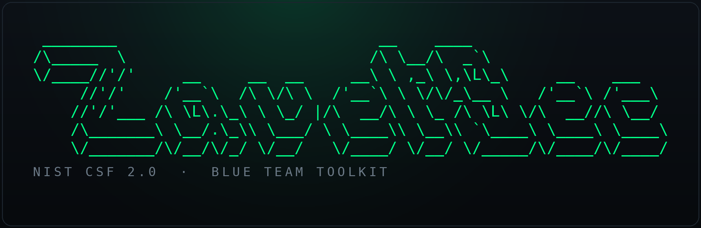

<div align="center">



### NIST CSF 2.0 для SOC — операционный набор blue team

Референс, самооценка зрелости и карта покрытия детектирования — всё для того,
чтобы наложить шесть функций NIST Cybersecurity Framework 2.0 на реальную работу
Security Operations Center и довести процессы до повторяемости и адаптивности.


</div>

---

## О чём это

«Колёсико NIST» — это **NIST Cybersecurity Framework 2.0**: шесть функций по кругу
(**Govern · Identify · Protect · Detect · Respond · Recover**), на которых удобно
описывать, чем занимается организация в части киберриска и насколько это зрело.

CSF сам по себе — не чеклист настроек, а **язык управления риском**. Этот репозиторий
переводит его на язык повседневной работы SOC: что именно делать по каждой функции,
как измерять зрелость и как понять, какие use-case'ы детектирования уже закрыты,
а какие остаются пробелами.

Весь набор **стек-агностичен** (везде указаны классы систем — SIEM, EDR/XDR, NDR,
SOAR, IdP — а не конкретные продукты), **самодостаточен** (единый HTML-файл, ноль
внешних зависимостей и сетевых запросов) и работает офлайн прямо в браузере.

---

## Состав

| # | Файл | Что это | Формат |
|---|------|---------|--------|
| 01 | [`nist-csf-soc-framework.html`](nist-csf-soc-framework.html) | Операционный референс по шести функциям | Документ |
| 02 | [`soc-maturity-self-assessment.html`](soc-maturity-self-assessment.html) | Интерактивная самооценка зрелости (Tier 1–4) | Инструмент |
| 03 | [`csf-coverage-map.html`](csf-coverage-map.html) | Карта покрытия use-case'ов CSF × MITRE | Воркшит |

Документы образуют связку: **референс** объясняет модель, **самооценка** показывает,
где вы сейчас по зрелости, а **карта покрытия** — что конкретно закрыто на уровне
детектов. Можно использовать по отдельности, но вместе они закрывают цикл
«понять → измерить → закрыть пробелы».

---

### 01 · Операционный референс

**`nist-csf-soc-framework.html`**

Ядро набора. Каждая из шести функций разобрана единообразным блоком:

- суть функции и её роль в колесе;
- официальные категории с кодами (`GV.OC`, `DE.CM`, `RS.MI` и т.д.);
- **зона ответственности SOC** — где SOC владелец, где соисполнитель, где поставщик данных;
- пошаговый чеклист внедрения;
- метрики функции (операционные и управленческие);
- **лестница зрелости** от Tier 1 (Partial) до Tier 4 (Adaptive).

Дополнительно: визуализация колеса, модель зрелости из четырёх Tier'ов, дорожная
карта внедрения по фазам 0–4, сводный каталог метрик с разделением аудиторий,
матрица разграничения SOC / IT / бизнес в логике RACI и чеклист самооценки.

> Акцент по всему документу: **Detect и Respond — безоговорочное ядро SOC**,
> **Govern** в центре колеса замыкает технику на риск-стратегию, а **Recover**
> через цикл lessons learned питает новые детекты — без этого зрелость не растёт.

---

### 02 · Самооценка зрелости

**`soc-maturity-self-assessment.html`**

Интерактивный чеклист из 31 утверждения по шести функциям. Отмечаете то, что верно
**прямо сейчас** — без «почти» и «в планах»:

- проценты, прогресс-бары и **Tier по каждой функции** пересчитываются на лету;
- общий уровень считается по принципу **«слабого звена»** (минимальный Tier среди
  функций) — честнее среднего, потому что зрелость гейтится самой слабой функцией;
- Detect и Respond помечены как ядро;
- кнопка «копировать сводку» выгружает результат текстом для отчёта;
- прогресс сохраняется локально в браузере между сессиями.

**Целевой ориентир:** Tier 3 по Detect / Respond и Tier 2–3 по остальным функциям,
с движением к Adaptive в приоритетных направлениях. Разрывы до целевого уровня —
это и есть backlog внедрения.

---

### 03 · Карта покрытия детектирования

**`csf-coverage-map.html`**

Воркшит-маппинг: 37 детектирующих и реагирующих use-case'ов разложены по функциям и
категориям CSF, с источником данных, классом инструмента и техникой противника по
**MITRE ATT&CK**. По каждому — редактируемый статус:

- 🟢 **Covered** — детект работает и протестирован
- 🟡 **Partial** — частичное покрытие / не оттюнено
- 🔴 **Gap** — пробел, нет детекта
- ⚪ **N/A** — не применимо к инфраструктуре

Сводный счётчик и цветная полоса покрытия обновляются на лету, есть экспорт в CSV.
**Gap-строки по Detect и Respond** после заполнения образуют приоритетный backlog
для detection engineering. Набор use-case'ов — стартовый, расширяется под свою
модель угроз и релевантные группировки.

---

## Как пользоваться

```text
1.  Прочитать референс (01) — понять модель и зоны ответственности SOC.
2.  Пройти самооценку (02) — зафиксировать текущий и целевой Tier по функциям.
3.  Заполнить карту покрытия (03) — отметить статусы, выявить Gap'ы.
4.  Разрывы зрелости + Gap'ы детектов = backlog внедрения.
5.  Двигаться по дорожной карте (фазы 0–4 в референсе).
6.  Пересматривать самооценку и покрытие раз в квартал.
```

Открытие — двойным кликом по файлу в браузере или через GitHub Pages. Интернет не
нужен: всё внутри HTML, никакой телеметрии, данные инструментов хранятся только
локально в вашем браузере.

---

## Дизайн и принципы

- **Zero dependencies** — каждый файл самодостаточен, без CDN, скриптов и сетевых вызовов.
- **Offline-first** — работает без интернета, ничего наружу не отправляет.
- **Stack-agnostic** — классы инструментов вместо продуктов; подставляйте свой стек.
- **Privacy by default** — состояние инструментов хранится в `localStorage`, не на сервере.
- Единый тёмный визуальный стиль, моноширинная типографика, печать в PDF из браузера.

---

## Лицензия

[MIT](LICENSE) — используйте, адаптируйте и распространяйте свободно, в том числе в
коммерческих и корпоративных контурах. Атрибуция приветствуется, но не обязательна.

---

<div align="center">

**ZavetSec** · инструменты для blue team · zero dependencies · offline-first

<sub>NIST CSF — фреймворк NIST; MITRE ATT&CK — торговая марка MITRE. Репозиторий не аффилирован с NIST или MITRE.</sub>

</div>
